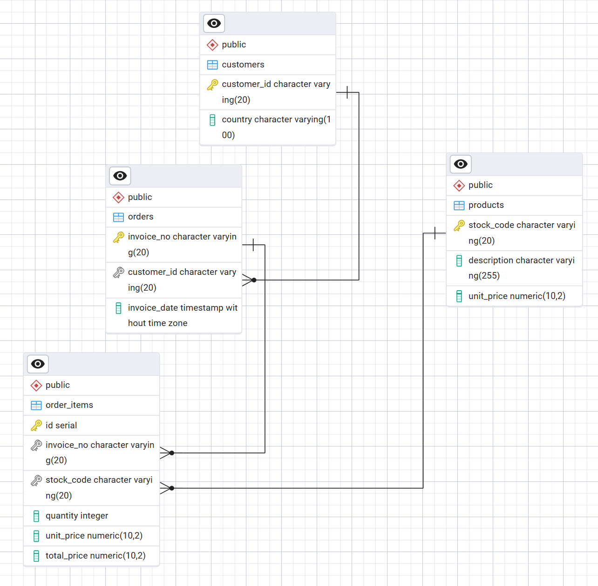
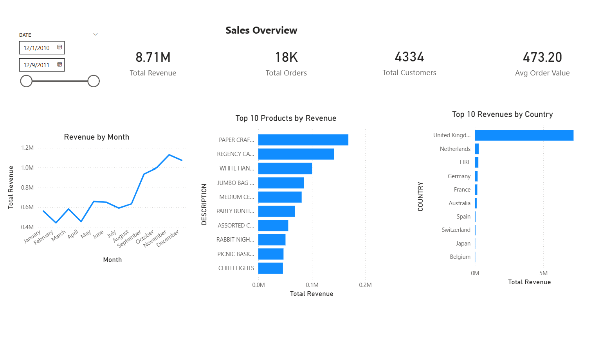
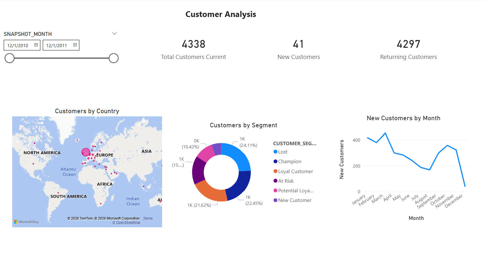
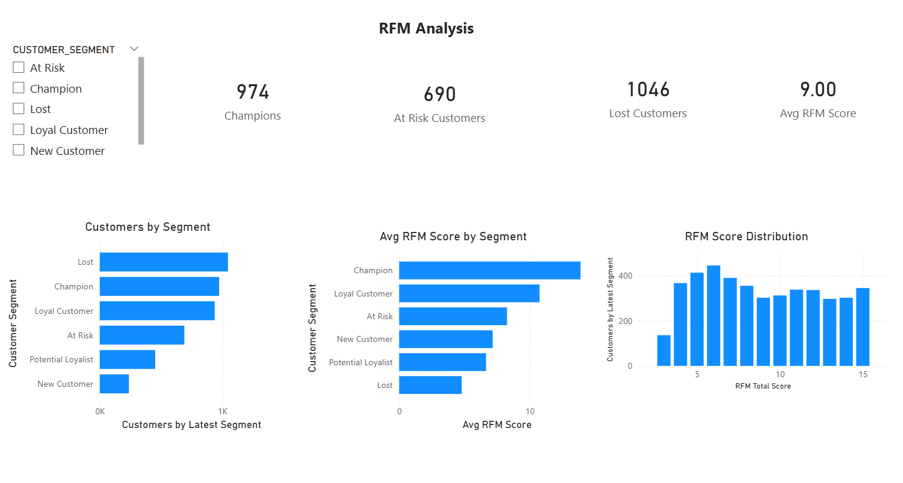
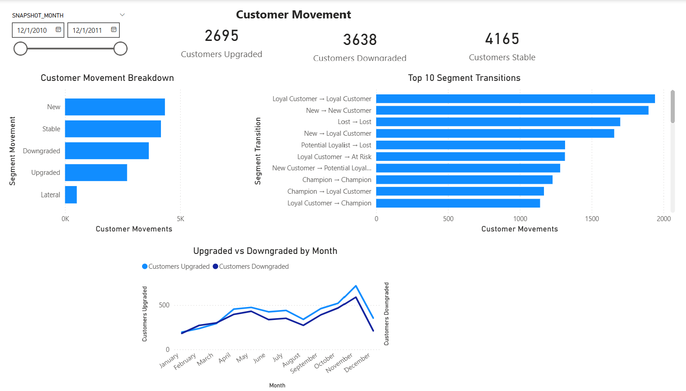

# Ecommerce ELT Pipeline

An end-to-end ELT pipeline that ingests raw ecommerce transaction data from Kaggle, transforms it through multiple layers using dbt and Python, stores it in both Snowflake and Postgres, and visualises business insights in PowerBI.


---

## Table of Contents

- [Project Overview](#project-overview)
- [Architecture](#architecture)
- [Tech Stack](#tech-stack)
- [Data Pipeline Layers](#data-pipeline-layers)
- [Data Model — 3NF (Postgres)](#data-model--3nf-postgres)
- [Dimensional Model — Gold Layer (Snowflake)](#dimensional-model--gold-layer-snowflake)
- [PowerBI Dashboards](#powerbi-dashboards)
- [Project Structure](#project-structure)
- [Setup and Installation](#setup-and-installation)
- [Running the Pipeline](#running-the-pipeline)
- [Testing](#testing)
- [Future Improvements](#future-improvements)

---

## Project Overview

This project simulates a real-world data engineering pipeline for an online retail business. The source data is the [UCI Online Retail dataset](https://www.kaggle.com/datasets/carrie1/ecommerce-data) from Kaggle — containing 541,909 transactions from a UK-based retailer between December 2010 and December 2011.

The pipeline answers business questions like:
- Which products generate the most revenue?
- Which customers are Champions vs Lost?
- Is the business growing or losing customers over time?
- Which countries drive the most sales?

---

## Architecture

```
┌─────────────┐     ┌──────────────────┐     ┌─────────────────────┐
│   Kaggle    │────▶│  Snowflake       │────▶│  Snowflake          │
│  Dataset    │     │  Bronze Layer    │     │  Silver Layer       │
│  (7.2MB)    │     │  raw_ecommerce   │     │  silver_ecommerce   │
└─────────────┘     └──────────────────┘     └─────────────────────┘
                           │                          │
                    Python (kagglehub)          dbt Core
                    PUT → COPY INTO             Clean + Deduplicate
                                                        │
                                               ┌────────┴────────┐
                                               │                 │
                                    ┌──────────▼──────┐  ┌───────▼──────────┐
                                    │  Postgres 3NF   │  │  Snowflake Gold  │
                                    │  customers      │  │  dim_customers   │
                                    │  products       │  │  dim_products    │
                                    │  orders         │  │  dim_date        │
                                    │  order_items    │  │  fact_sales      │
                                    └─────────────────┘  └──────────────────┘
                                                                  │
                                                         ┌────────▼────────┐
                                                         │  Snowflake      │
                                                         │  Marts Layer    │
                                                         │  mart_invoices  │
                                                         │  mart_rfm_      │
                                                         │  snapshot       │
                                                         │  mart_rfm_      │
                                                         │  movement       │
                                                         └────────┬────────┘
                                                                  │
                                                         ┌────────▼────────┐
                                                         │    PowerBI      │
                                                         │   Dashboards    │
                                                         └─────────────────┘
```

All orchestration is managed by **Apache Airflow** running in Docker Compose. dbt transformations run in an isolated Docker container via Airflow's DockerOperator to avoid Python dependency conflicts between dbt-snowflake and Airflow.

---

## Tech Stack

| Tool | Purpose |
|------|---------|
| Python 3.10 | Data extraction and loading scripts |
| Apache Airflow 2.7.0 | Pipeline orchestration |
| dbt Core 1.9.0 | Data transformation (Silver, Gold, Marts) |
| Snowflake | Cloud data warehouse (Bronze, Silver, Gold, Marts) |
| Postgres 15 | Relational 3NF operational database |
| Docker Compose | Container orchestration |
| Redis | Celery message broker |
| PowerBI Desktop | Business intelligence dashboards |
| pytest | Unit testing |
| GitHub Actions | CI/CD automated test runs on push |
| pgAdmin 4 | Postgres database visualisation and ERD generation |
| kagglehub | Kaggle dataset download API |

---

## Data Pipeline Layers

### Bronze — Raw Ingestion
Raw data is downloaded from Kaggle using `kagglehub` and uploaded to Snowflake via a staged PUT → COPY INTO operation. No transformations are applied — this layer is an exact copy of the source data.

```
extract_load_kaggle.py:
  kaggle_dataset()     → download dataset, copy CSV to /opt/data/raw/
  put_to_stage()       → PUT file into Snowflake internal stage
  copy_to_bronze()     → COPY INTO ecommerce.bronze.raw_ecommerce
  validate_load()      → check for failed rows, verify row count
```

### Silver — Cleaning and Deduplication
dbt view built on top of Bronze. Applies data quality rules — filters out nulls, removes duplicates using `QUALIFY ROW_NUMBER()`, calculates `total_price`, and standardises data types.

```sql
-- Silver deduplication using QUALIFY
QUALIFY ROW_NUMBER() OVER (
    PARTITION BY invoice_no, stock_code
    ORDER BY invoice_date
) = 1
```

### Postgres 3NF — Normalised Relational Store
Silver data is loaded into a normalised Postgres database following Third Normal Form (3NF). The load order respects foreign key constraints: `customers → products → orders → order_items`. All inserts use `ON CONFLICT DO NOTHING` for idempotent reruns.

### Custom dbt Test
A generic custom test lives at `ecommerce_dbt/tests/generic/test_unique_combination.sql` — it tests that a combination of two columns is unique across a model. This is used on `fact_sales` to enforce the grain (invoice_no + stock_code must be unique together), since neither column is unique on its own.

```sql
-- tests/generic/test_unique_combination.sql
-- Usage in schema.yml:
-- - dbt_utils.unique_combination_of_columns:
--     combination_of_columns: [invoice_no, stock_code]
```
dbt tables built using Kimball dimensional modelling methodology:

| Step | Decision |
|------|---------|
| Business process | Online retail sales |
| Grain | One row per order line item (invoice_no + stock_code) |
| Dimensions | customers, products, date |
| Facts | quantity, unit_price, total_price |

### Marts — Analytical Views
Flat denormalised views purpose-built for PowerBI consumption:

- **mart_invoices** — flat denormalised view joining fact_sales with all dimensions and countries seed (14 columns including surrogate key)
- **mart_rfm_snapshot** — cumulative RFM scores (1-5) and customer segments calculated per customer per month — one row per customer per month
- **mart_rfm_movement** — built on top of mart_rfm_snapshot, uses LAG to track how each customer's RFM scores and segment change month over month, classifies movement as Upgraded, Downgraded, Stable, New or Lateral

---

## Data Model — 3NF (Postgres)



The Postgres database follows Third Normal Form — each table has a single primary key and all non-key columns depend only on that key.

| Table | Primary Key | Foreign Keys | Rows |
|-------|------------|--------------|------|
| customers | customer_id | — | 4,338 |
| products | stock_code | — | 3,916 |
| orders | invoice_no | customer_id → customers | 18,532 |
| order_items | invoice_no + stock_code | invoice_no → orders, stock_code → products | 387,841 |

---

## Dimensional Model — Gold Layer (Snowflake)

```
ECOMMERCE.GOLD
├── dim_customers   (4,338 rows)  — customer_id, country
├── dim_products    (3,916 rows)  — stock_code, description, unit_price
├── dim_date          (373 rows)  — date, year, quarter, month, week, day
└── fact_sales     (541,909 rows) — sales_id (MD5 surrogate key), invoice_no,
                                   stock_code, customer_id, date_id,
                                   quantity, unit_price, total_price

ECOMMERCE.MARTS
├── mart_invoices       — flat view joining fact + all dims + countries seed (14 columns)
├── mart_rfm_snapshot   — cumulative RFM scores + segments per customer per month
└── mart_rfm_movement   — month-over-month segment movement tracking using LAG
```

---

## PowerBI Dashboards

The PowerBI report connects directly to `ECOMMERCE.MARTS` in Snowflake using Import mode for fast visual performance.

### Page 1 — Sales Overview


Key metrics: **£8.71M total revenue**, **18K orders**, **4,334 customers**, **£473 avg order value**.

Revenue follows a classic Christmas retail pattern — flat around £0.6M from January to August, climbing sharply to £1.2M in November before a slight December drop. The UK dominates at roughly £7M, nearly 10x the next largest market (Netherlands). Paper Craft and Regency Cakestand are the top two revenue products by a significant margin. The high average order value of £473 suggests a B2B wholesale model rather than a consumer retail business.

### Page 2 — Customer Analysis


Key metrics: **4,338 total customers**, **41 new customers**, **4,297 returning customers**.

New customer acquisition declined throughout the year from 420 in January to just 41 in December — the business relies almost entirely on its existing customer base. The customer segment donut shows Lost (24.11%) as the largest segment, followed by Champions (22.45%) and Loyal Customers (21.62%). Champions and Loyal Customers together make up 44% of all customers — a strong loyal core. The large UK bubble on the world map confirms the business's heavy geographic concentration.

### Page 3 — RFM Analysis


Key metrics: **974 Champions**, **690 At Risk**, **1,046 Lost**, **9.0 avg RFM score**.

Each customer is scored 1-5 on Recency, Frequency and Monetary dimensions (total score range 3-15). The average score of 9 out of 15 places the business at a middle level. The RFM Score Distribution chart shows a slight peak at scores 5-7, meaning more customers lean toward the lower end — a healthy business would peak toward the right. The Avg RFM Score by Segment chart validates the model: Champions score around 12, Loyal Customers around 10, Lost customers around 5 — clearly separated meaningful groups.

### Page 4 — Customer Movement


Key metrics: **2,695 upgraded**, **3,638 downgraded**, **4,165 stable**.

Tracks how customers move between RFM segments month over month. More customers downgraded than upgraded across the full year (3,638 vs 2,695) — a warning signal for the business. The most common transition is Loyal Customer → Loyal Customer (~1,900), showing strong retention at the top. The most concerning pattern is Lost → Lost (~1,650) — lost customers are not being reactivated. The Upgraded vs Downgraded by Month chart shows both lines tracking closely together, peaking in November and dropping sharply in December due to reduced transaction volume at year end.

---

## Project Structure

```
ecommerce-elt/
├── airflow/
│   ├── dags/
│   │   ├── kaggle_to_snowflake_bronze.py  # Bronze ingestion + pipeline entry point
│   │   ├── silver_transformation.py        # dbt Silver run + test
│   │   ├── silver_to_postgres.py           # Silver → Postgres 3NF load
│   │   └── gold_transformation.py          # dbt Gold + Marts run + test
│   ├── logs/
│   ├── requirements.txt                    # Airflow Python dependencies
│   └── Dockerfile                          # Airflow image — installs requirements.txt
├── ecommerce_dbt/
│   ├── models/
│   │   ├── silver/
│   │   │   ├── silver_ecommerce.sql
│   │   │   ├── schema.yml
│   │   │   └── sources.yml
│   │   ├── gold/
│   │   │   ├── dim_customers.sql
│   │   │   ├── dim_products.sql
│   │   │   ├── dim_date.sql
│   │   │   ├── fact_sales.sql
│   │   │   └── schema.yml
│   │   └── marts/
│   │       ├── mart_invoices.sql           # flat denormalised view for invoice analysis
│   │       ├── mart_rfm_snapshot.sql       # cumulative RFM scores per customer per month
│   │       ├── mart_rfm_movement.sql       # month-over-month segment movement using LAG
│   │       └── schema.yml
│   ├── seeds/
│   │   └── countries.csv                   # ISO country codes reference data
│   ├── macros/
│   │   └── generate_schema_name.sql        # custom schema resolver macro
│   ├── tests/
│   │   └── generic/
│   │       └── test_unique_combination.sql # custom dbt test for composite unique keys
│   ├── analyses/
│   │   └── ecommerce_dashboard.pbix        # PowerBI dashboard file
│   ├── snapshots/
│   ├── dbt_project.yml
│   ├── packages.yml
│   ├── package-lock.yml                    # dbt package lock file (dbt_expectations)
│   ├── requirements.txt                    # dbt Python dependencies
│   ├── README.md                           # dbt project documentation
│   └── Dockerfile                          # dbt image — installs requirements.txt
├── elt/
│   ├── extract_load_kaggle.py              # Kaggle download + Snowflake Bronze load
│   └── silver_to_postgres.py              # Snowflake Silver → Postgres 3NF load
├── sql/
│   └── 01_postgres_setup.sql              # Postgres DDL — tables, PKs, FKs, constraints
├── tests/
│   ├── conftest.py                         # shared pytest fixtures + sample DataFrames
│   ├── test_extract_load_kaggle.py         # 12 unit tests
│   └── test_silver_to_postgres.py         # 21 unit tests
├── config/
│   ├── __init__.py                         # makes config a Python package
│   └── paths.py                           # RAW_DIR and path constants
├── data/
│   └── raw/                               # CSV files downloaded from Kaggle
├── docs/
│   ├── erd_diagram.png                    # Postgres 3NF ERD from pgAdmin
│   ├── dashboard_sales_overview.png
│   ├── dashboard_customer_analysis.png
│   ├── dashboard_rfm_analysis.png
│   └── dashboard_customer_movement.png
├── .github/
│   └── workflows/
│       └── tests.yml
├── docker-compose.yml
├── .env.example
├── .gitignore
├── .gitattributes
├── pytest.ini
├── requirements-test.txt
└── README.md
```

---

## Setup and Installation

### Prerequisites
- Docker Desktop with WSL2 (Windows) or Docker Engine (Linux/Mac)
- Python 3.10+
- Snowflake account (free trial at snowflake.com)
- Kaggle account with API credentials (~/.kaggle/kaggle.json)

### 1. Clone the repository
```bash
git clone https://github.com/yourusername/ecommerce-elt.git
cd ecommerce-elt
```

### 2. Configure environment variables
```bash
cp .env.example .env
```

Edit `.env` and fill in your credentials:
```bash
SNOWFLAKE_ACCOUNT=your_account
SNOWFLAKE_USER=your_user
SNOWFLAKE_PASSWORD=your_password
SNOWFLAKE_WAREHOUSE=your_warehouse
SNOWFLAKE_DATABASE=ecommerce
SNOWFLAKE_ROLE=your_role

POSTGRES_ECOMMERCE_USER=ecommerce_user
POSTGRES_ECOMMERCE_PASSWORD=your_password
POSTGRES_ECOMMERCE_DB=ecommerce
```

### 3. Configure dbt profiles
Create `~/.dbt/profiles.yml`:
```yaml
ecommerce_dbt:
  target: dev
  outputs:
    dev:
      type: snowflake
      account: "{{ env_var('SNOWFLAKE_ACCOUNT') }}"
      user: "{{ env_var('SNOWFLAKE_USER') }}"
      password: "{{ env_var('SNOWFLAKE_PASSWORD') }}"
      role: "{{ env_var('SNOWFLAKE_ROLE') }}"
      database: "{{ env_var('SNOWFLAKE_DATABASE') }}"
      warehouse: "{{ env_var('SNOWFLAKE_WAREHOUSE') }}"
      schema: dev
      threads: 4
```

### 4. Build Docker images
```bash
# build Airflow image
docker compose build

# build dbt image
docker compose --profile dbt build
```

### 5. Start the stack
```bash
docker compose up -d
```

Verify all services are healthy:
```bash
docker compose ps
```

Expected output:
```
init-permissions   → Exit 0     (completed successfully)
postgres           → healthy    (Airflow metadata DB)
ecommerce-postgres → healthy    (3NF data warehouse)
redis              → healthy    (Celery broker)
init-airflow       → Exit 0     (DB migrated, admin user created)
airflow-webserver  → running    (localhost:8080)
airflow-scheduler  → running
airflow-worker     → healthy
pgadmin            → running    (localhost:5050)
```

---

## Running the Pipeline

### 1. Access Airflow UI
Open `http://localhost:8080` and login with your configured admin credentials.

### 2. Unpause all DAGs
Toggle all 4 DAGs from paused (grey) to active (blue):
- `kaggle_to_snowflake_bronze`
- `silver_transformation`
- `silver_to_postgres`
- `gold_transformation`

### 3. Trigger the pipeline
Click the play button next to `kaggle_to_snowflake_bronze`. The full pipeline chains automatically:

```
kaggle_to_snowflake_bronze  (@daily — only this DAG has a schedule)
  └── extract_load_kaggle        (BashOperator)
  └── trigger_silver_transformation
        └── dbt_run_silver       (DockerOperator)
        └── dbt_test_silver      (DockerOperator)
        └── trigger_silver_to_postgres
              └── load_silver_to_postgres  (BashOperator)
        └── trigger_gold_transformation
              └── dbt_run_gold   (DockerOperator — runs gold.* marts.*)
              └── dbt_test_gold  (DockerOperator — tests gold.* marts.*)
```

### 4. Connect PowerBI
Open PowerBI Desktop → Get Data → Snowflake:
```
Server:    <your_account>.snowflakecomputing.com
Warehouse: your_warehouse
Database:  ecommerce
Schema:    MARTS
Mode:      Import
```

Select `MART_INVOICES` and `MART_RFM` → Load.

---

## Testing

Unit tests cover the two main Python scripts using `pytest` and `unittest.mock`. No real database connections are made during testing — all external calls are mocked.

### Run tests locally
```bash
pip install -r requirements-test.txt
pytest tests/ -v
```

### Test coverage — 33 tests total

**test_extract_load_kaggle.py (12 tests)**
- Successful download copies CSV to RAW_DIR
- kagglehub fallback path logic for both v1 and v2 folder structures
- RuntimeError raised when both fallback paths are missing
- RuntimeError raised when no CSV files found in download path
- RAW_DIR created automatically if it does not exist
- Snowflake connector called with correct env var values
- PUT command targets correct stage with AUTO_COMPRESS=TRUE
- COPY INTO targets correct table with correct file format and ON_ERROR=CONTINUE
- validate_load executes both VALIDATE and COUNT(*) queries
- load_to_snowflake calls put → copy → validate in correct order
- Snowflake connection closed on both success and failure

**test_silver_to_postgres.py (21 tests)**
- Snowflake connection uses hardcoded SILVER schema (not env var)
- Postgres connection uses all ecommerce env vars
- Column names lowercased after Snowflake fetch (Snowflake returns uppercase)
- FK guards correctly filter unknown customers, products and invoices
- Null handling matches Postgres NOT NULL constraints per column
- Deduplication applied on all primary key columns
- ON CONFLICT DO NOTHING used on all inserts for idempotent reruns
- commit() called once after all tables loaded successfully
- rollback() called when any step raises an exception
- All connections closed in finally block regardless of success or failure
- Load order enforced: customers → products → orders → order_items

### GitHub Actions CI
Tests run automatically on every push and pull request to `main`. View results in the **Actions** tab of the GitHub repository.

---

## Future Improvements

### dbt Cloud Migration
The dbt transformations currently run in Docker containers managed by Airflow's DockerOperator. These can be migrated to dbt Cloud for a fully managed transformation layer:

```
Step 1 → Sign up at cloud.getdbt.com
Step 2 → Connect GitHub repo — dbt Cloud reads models automatically
Step 3 → Connect Snowflake using same credentials
Step 4 → Create a Job: dbt run --select silver + dbt test --select silver (@daily)
Step 5 → Create another Job for gold + marts
Step 6 → Replace DockerOperator tasks in Airflow DAGs with HTTP calls to dbt Cloud API
```

### Airflow Connections for Secret Management
Currently credentials are managed via `.env` file. In production, Snowflake and Postgres credentials should be stored as Airflow Connections (encrypted in the metadata database) and accessed via `BaseHook.get_connection()` — eliminating plaintext credentials in environment files entirely.

### Incremental dbt Models
The Gold layer uses `materialized='table'` which rebuilds everything on every run. Switching to `materialized='incremental'` would only process new rows since the last run — significantly reducing compute costs and run time on large datasets.

### Cloud Deployment
The current stack runs on local Docker Compose. A production deployment would use:
- AWS EC2 or GCP Compute Engine for Airflow
- AWS RDS or Cloud SQL for Postgres (replacing the container)
- ElastiCache or Cloud Memorystore for Redis (replacing the container)
- Snowflake remains as-is (already cloud-native)

### Kubernetes
Replace Docker Compose with Kubernetes using the official Airflow Helm chart for better scalability, self-healing and resource management across multiple workers.

### SCD Type 2 for Customer History
The current `dim_customers` uses SCD Type 0 (keep first appearance). Implementing SCD Type 2 using dbt snapshots would track how customer attributes change over time, enabling true historical analysis of customer behaviour.

### PowerBI Scheduled Refresh
Configure automatic PowerBI dataset refresh via the Snowflake connector so dashboards stay current after each daily pipeline run without manual intervention.

### Additional Data Sources
Extend beyond a single Kaggle dataset — integrate external APIs (weather data, economic indicators, competitor pricing) to enrich ecommerce transactions with contextual signals.

---

## License

This project is for educational and portfolio purposes. The ecommerce dataset is sourced from the [UCI Online Retail Dataset on Kaggle](https://www.kaggle.com/datasets/carrie1/ecommerce-data).
